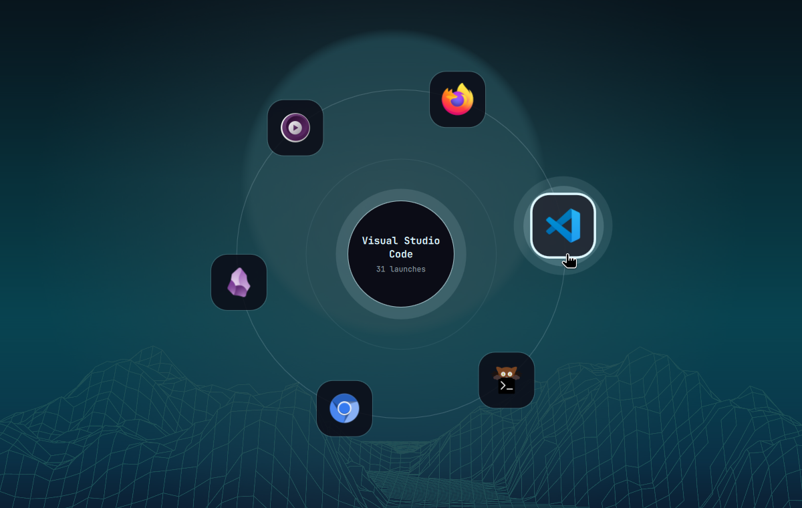

# Gravity

An [Omarchy](https://omarchy.org/) shell plugin: an orbital launcher that
surfaces the apps you actually use. Six icons on one turning ring, centred on
the screen, ranked by how often you have opened them **in the last three
days** — not by a favourites list you have to maintain.



> [!IMPORTANT]
> **Gravity is an Omarchy plugin, not a standalone Quickshell widget.** It is
> loaded by `omarchy-shell`'s plugin loader, registers its IPC through it,
> imports the shell's `qs.Commons` / `qs.Ui` modules for layout and controls,
> and takes every colour from Omarchy's theme engine. It will **not** run on
> vanilla Hyprland + Quickshell without significant rework — see
> [Requirements](#requirements) for exactly what it leans on.

<!-- Still worth adding: orbit.gif — the staggered burst on open, then the
     rotation pausing as the cursor lands on an icon. A still cannot show it. -->

## What makes it different

Gravity counts **every** window that opens on your desktop, not just the ones
launched from its own panel. It listens to Hyprland's event socket for the
whole session, so opening v2rayN from a keybinding, a terminal, an autostart
or a link handler all count the same. If v2rayN is the first thing you reach
for after a boot, it climbs into the ring on its own, and nobody had to
configure anything.

## Features

- **A rolling three-day ranking.** The orbit is the top of what you have
  launched in the last 72 hours. A new habit shows up within a few launches,
  and an old one leaves on its own: launches stop counting once they age past
  the window, so an app you hammered last week is gone without you doing
  anything. What is on the ring is what you are using *now*, not a lifetime
  scoreboard that the first month of use freezes in place.
- **System-wide tracking.** Counts come from Hyprland's `openwindow` stream, so
  they reflect how you use the machine, not how you use this widget.
- **Launch or focus.** Clicking an app focuses its window if one exists, and
  launches it if not. The window it focuses is deterministic — always the first
  one Hyprland lists for that class — so the same click lands in the same place
  every time, rather than cycling.
- **Pinning.** Apps you always want within reach hold their slot regardless of
  count, in the order you list them, with the ranking filling what is left.
- **Never an empty ring.** A fresh install has nothing to rank, so the spare
  slots fill with suggestions drawn from your installed apps. They are a
  placeholder, not a ranking: every one gives way the moment a real app earns
  the slot, and the ring stops suggesting entirely once six real ones fill it.
- **A fixed ring, not a list.** At most six apps, always on one circle, always
  in the same places — so a slot becomes a position you can aim at from muscle
  memory rather than a row you have to read.
- **Icons burst out from the centre**, one after another with a beat between
  them, and collapse back the same way on close.
- **Keyboard driven.** Arrows, Tab, or `1`–`6` select; Enter activates; Esc
  closes. Focus is grabbed as the panel opens, so the keyboard works
  immediately.
- **Rotation that pauses when you aim.** The ring turns slowly and stops the
  moment an icon is hovered or selected, so you are never chasing a target.
- **Theme-adaptive.** Every colour comes from the active Omarchy theme, so the
  orbit re-skins on `omarchy theme set` with nothing to configure.

## Requirements

- **Omarchy 4 ("Quattro") or newer** — the Quickshell-based `omarchy-shell`.
- **Hyprland**, for the event socket the usage tracker reads and the
  `hyprctl` calls that focus a window.

Built and tested on Omarchy 4.0.2 (Quickshell 0.3.1, Qt 6.11). No network
access, no external fonts, no third-party dependencies.

### Why it is Omarchy-only

Four separate pieces of `omarchy-shell` hold this plugin up. None of them
exist in a bare Quickshell config:

| It uses | For |
|---|---|
| the plugin loader + `manifest.json` contract | mounting the bar widget once per monitor and the usage service once per session |
| the shell's IPC host | the `gravity` and `gravity-usage` targets that `omarchy-shell` forwards to |
| `qs.Commons` / `qs.Ui` | `Panel`, `BarWidget`, `BarIconButton`, `PanelKeyCatcher`, `Style`, `Color`, `Util` |
| the theme engine | every colour, read from the active theme's `colors.toml` and `shell.toml` |

Porting it to vanilla Hyprland + Quickshell means replacing all four: a host
that loads the QML, an IPC surface, the ~dozen UI components it imports, and a
palette. The logic that is genuinely portable is deliberately isolated in
`Orbit.js`, which is Qt-free.

## Install

```bash
omarchy plugin add https://github.com/mahziyarng98/omarchy-gravity.git --enable
```

Plugins land disabled by default so you can read the code first; `--enable`
skips that and puts the widget into the bar's left section. Move it with:

```bash
omarchy bar move io.github.mahziyarng98.gravity --section right
```

## Update

```bash
omarchy plugin update io.github.mahziyarng98.gravity
```

## Usage

Click the turning mark in the bar, or press the shortcut. The panel opens
centred on the screen and the icons burst out from the middle one after
another. Click an app to launch or focus it; click anywhere else, or press
Esc, to dismiss.

### The keyboard shortcut

Gravity ships no binding of its own — Omarchy owns your keymap. Add one line:

```lua
-- ~/.config/hypr/bindings.lua
o.bind("SUPER + CTRL + G", "Gravity", "omarchy-shell gravity toggle")
```

`SUPER + CTRL + G` is the suggested default: `SUPER + CTRL` is the row Omarchy
already uses for shell panels (`A` audio, `B` bluetooth, `D` display, `W`
network, `P` power), and `G` is free in it on a stock install. Check before
you commit to it, since your own bindings may differ:

```bash
omarchy menu keybindings --print | grep -iE "\+ G( |$)"
```

To use a different combination, change the keys in that same line — the
command never changes. If the one you want is already spoken for, unbind it
first:

```lua
hl.unbind("SUPER + SHIFT + SPACE")   -- stock: toggle the top bar
o.bind("SUPER + SHIFT + SPACE", "Gravity", "omarchy-shell gravity toggle")
```

Reload with `hyprctl reload`; no shell restart is needed.

### Inside the panel

The panel takes keyboard focus when it opens.

| Key | Action |
|---|---|
| `→` `↓` / `l` `j` / `Tab` | select the next app, clockwise |
| `←` `↑` / `h` `k` / `Shift-Tab` | select the previous app |
| `1`–`6` | activate that slot directly |
| `Enter` / `Space` | launch or focus the selected app |
| `Esc` | close without selecting |

Selecting with the keyboard stops the rotation and highlights the icon exactly
as hovering does, so what is selected is never ambiguous.

### IPC

For a keybinding, a script, or just to check that the plugin is live:

```bash
omarchy-shell gravity toggle    # what the keybinding runs
omarchy-shell gravity open
omarchy-shell gravity close
```

The IPC target is `gravity` — deliberately shorter than the plugin id, so a
keybinding stays readable. The usage store has a second target of its own,
`gravity-usage`; see [The usage store](#the-usage-store).

## Configuration

Settings live inline on the widget's entry in `~/.config/omarchy/shell.json`
and hot-reload on save:

```json
{
  "id": "io.github.mahziyarng98.gravity",
  "pinned": "v2rayN, org.gnome.Nautilus",
  "ignored": "xdg-desktop-portal-gtk",
  "slots": 6,
  "orbitSeconds": 45
}
```

| Key | Default | Effect |
|---|---|---|
| `pinned` | `""` | window classes that always hold a slot, in orbit order |
| `ignored` | `""` | window classes that never earn a slot, however often they open |
| `slots` | `6` | how many icons sit on the ring (3–6; six is the maximum the circle holds) |
| `orbitSeconds` | `45` | seconds per revolution |

Both lists are comma-separated **window classes**, not app names. To read the
class of a running window:

```bash
hyprctl clients -j | jq -r '.[].class' | sort -u
```

A pinned app is shown even if it has never been launched and even if it has no
`.desktop` entry — you asked for it by name. An app that is neither pinned nor
resolvable to a `.desktop` entry never takes a slot, because there would be
nothing to launch when you clicked it. Neither do entries the desktop marks
`NoDisplay` — portal dialogs, agents, MIME shims — which open real windows but
are not things anyone launches. Pinning overrides that too.

## How the ranking works

Every top-level window that opens appends a timestamp to its window class's
list. An app's rank is **how many of those timestamps fall inside the last 72
hours** — counted against the clock at the moment the ranking is computed, not
at the moment something was launched. Ties break on the most recent launch.
Pinned apps are placed first, in configured order; the ranking fills the
remaining slots.

Because the count is derived from the clock rather than stored, an app leaves
the ring the moment its last qualifying launch ages out, with no new launch
needed to trigger it. An open panel re-checks once a minute; a panel that is
opened computes it fresh; `gravity-usage list` computes it when you ask.

Focusing an existing window does **not** count — no window was created — so
using Gravity to switch to an app you already have open never inflates its
position.

### Cold start

Ranking something you have not done yet is impossible, and a ring holding two
icons in a lot of empty space looks broken rather than new. So slots that
pinning and the ranking have not claimed are filled with suggestions, in that
order of priority:

1. pinned apps
2. apps ranked by launches in the last three days
3. suggestions, filling whatever is still empty

A suggestion never displaces anything real. One pinned app and two ranked apps
give you three suggestions; a sixth real app leaves none. The hub says
**Suggested** rather than a launch count for these, because a count of zero
would read as a verdict on the app rather than on the empty slot.

They are drawn from the same list Omarchy's own launcher shows — desktop
entries minus `NoDisplay`, minus `Hidden` / `OnlyShowIn` / `NotShowIn`, minus
`launcher.hides` — narrowed to entries that have both an icon to draw and a
command to run. `ignored` applies to suggestions too, so anything you never
want proposed can be named there — and it is applied when the reserve is
filled, not when the ring is drawn, so an ignored app never occupies one of
the held slots in the first place. Editing the list takes effect immediately:
anything it newly covers is dropped from the reserve and replaced.

The picks are rolled once and persisted, so the cold-start ring looks the same
tomorrow as it does today rather than reshuffling on every open. A pick is only
ever replaced when it has to be: a real app took the slot, or the app was
uninstalled and no longer resolves.

## The usage store

```
~/.local/state/omarchy/gravity/usage.json
```

Same convention as Omarchy's other stateful plugins: mutable per-machine state
lives under the XDG state directory, never in the config tree. It is plain
JSON, written by the plugin's background service and safe to read, edit, or
delete — a missing or corrupt file costs you the ranking, and using the machine
rebuilds it.

Alongside the launches, `suggestions` holds the rolled cold-start picks as
desktop ids, in the order the ring draws from them.

One list of launch times per window class. Timestamps are kept for four days
and count for three: the extra day is slack for a clock that steps backwards
(an NTP correction, a confused RTC after a reboot) so a small negative jump
cannot erase history that is still inside the window. Anything older is
dropped when the app is next launched, on a ten-minute sweep, and once when the
store loads — so the file stays a few KB however long the machine runs.

A store written by an older version (`"version": 1`, one integer per app) loads
without complaint and starts its window empty: a lifetime total cannot be
spread back over three days it never described, and a few days of use rebuilds
a truthful ranking.

```json
{
  "version": 1,
  "apps": {
    "v2rayN": {
      "launches": [1788618278, 1788640912, 1788702233],
      "desktopId": "v2rayn",
      "name": "v2rayN",
      "icon": "v2rayn"
    }
  },
  "suggestions": ["localsend", "vlc", "libreoffice-calc"]
}
```

A maintenance IPC target sits on top of it:

```bash
omarchy-shell gravity-usage list             # the ranking now, with what has aged out
omarchy-shell gravity-usage forget chromium  # drop one app
omarchy-shell gravity-usage reset            # start over
omarchy-shell gravity-usage record v2rayN    # count a launch by hand
omarchy-shell gravity-usage path             # where the store lives
omarchy-shell gravity-usage suggestions      # the cold-start picks, in order
omarchy-shell gravity-usage reroll           # throw them away and roll again
```

`record` exists so you can test the ranking without waiting for real usage to
accumulate.

## Architecture

| File | Role |
|---|---|
| `manifest.json` | plugin manifest: one `bar-widget` kind and one `service` kind |
| `BarWidget.qml` | the bar mark, the `gravity` IPC target, and the panel host |
| `Panel.qml` | the orbit: a full-screen layer-shell surface, centred |
| `Service.qml` | the Hyprland event listener and the only writer of the store |
| `OrbitGlyph.qml` | the turning mark, shared by the bar icon and the panel's hub |
| `Orbit.js` | the store format, the rolling window, the ranking, the geometry, the output parsing |

The counting lives in a `service` plugin rather than in the bar widget on
purpose: the shell mounts a service once per session, while a bar widget exists
once per monitor. Counting in the widget would double every launch on a
two-screen setup. One writer, any number of readers — the panel watches the
file.

## Development

The logic that can be tested without a compositor is in `Orbit.js`, which is
Qt-free and runs under node:

```bash
node test/orbit-test.js
```

To hack on the QML, put the plugin in
`~/.config/omarchy/plugins/io.github.mahziyarng98.gravity/`. A real directory
there is watched, and saving a file reloads the plugin on its own.

A **symlink** to a checkout elsewhere is the more comfortable setup, but the
shell's watcher does not follow it, and `omarchy-shell shell rescanPlugins`
does not pick up edited QML through one either (measured, not assumed: a
changed string only took effect after a restart). So with a symlinked
checkout, reload with:

```bash
omarchy-restart-shell
```

Shell logs, including QML warnings, land in the session journal:

```bash
journalctl --user -f _PID=$(pgrep -f 'quickshell -n -p /usr/share/omarchy/shell')
```

## License

MIT. See [LICENSE](LICENSE).
